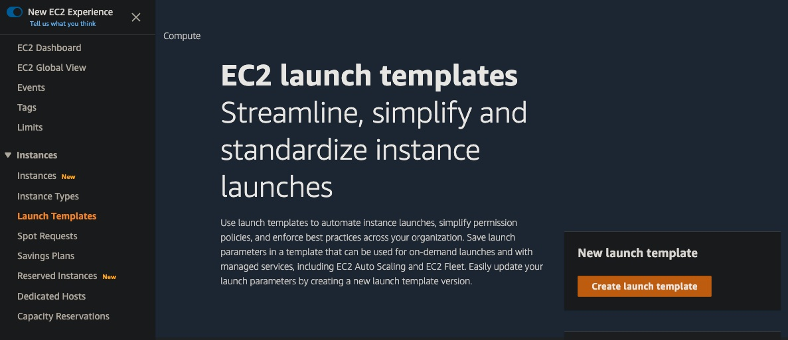

# High Availability and Scaling

Vertical scaling `aka` bigger and bigger machines, vs, horizontal scaling `aka` more machines.

3 questions when scaling:
- What? What do we scale?
  - We have to decide what sort of resource we're going to scale; how do we define the template?
- Where? Where do we scale?
  - When applying the model, where does it go? Should we scale out database? Or webservers?
- When? When do we scale?
  - How do we know we need more? CloudWatch alarms can tell us when it's time to add more resources.

## What are launch templates/configurations?

A launch template specifies all of the needed settings that go into building out an EC2 instance.
It is a collection of settings that you can configure so you don't have to walk through the EC2 wizard over and over.

| Templates                  | vs  | Configurations                |
|----------------------------|-----|-------------------------------|
| More than just autoscaling |     | Only for autoscaling          |
| Supports versioning        |     | Immutable                     |
| More granularity           |     | Limited configuration options |
| `AWS recommended`          |     | `Don't use them`              |



As always, it is better to avoid the AWS console and use e.g. Terraform:
```terraform
data "template_file" "user-data-hw" {
  template = <<-EOT
    #!/bin/bash -xe
    apt-get update -y
    apt-get install -y awscli docker.io jq
  EOT
}

resource "aws_launch_template" "hello-world" {
  name = "hello-template"
  disable_api_termination = true
  
  iam_instance_profile {
    name = "profile-1"
  }
  
  image_id = "${data.aws_ami.ubuntu-1804.id}"
  instance_initiated_shutdown_behavior = "terminate"
  instance_type = "t2.small"
  key_name = "key-1"
  vpc_security_group_ids = ["<sg-1>"]

  user_data = "${base64encode(data.template_file.user-data-hw.rendered)}"
}
```

We can attach to an auto scaling group (ASG):

```terraform
resource "aws_autoscaling_group" "hello-world-blue" {
  launch_template = {
    id      = "${aws_launch_template.hello-world.id}"
    version = "$Latest"
  }
  
  max_size = 0
  min_size = 0
  # more content...
}
```

So things to include in your launch template are:
- AMI
- EC2 instance size
- Security groups
- Potentially networking information (if supplied, cannot use the template in an ASG)

## Scaling EC2 instances with auto scaling

- Auto scaling groups:
  - These contain a collection of EC2 instances that are treated as a collective group for purposes of scaling and management.

- Auto scaling steps:
  - Define your template - Pick from your available launch templates or launch configurations.
  - Networking and purchasing - Pick your networking space and puchasing options; using multiple AZs allows for high availability.
  - ELB configuration - EC2 instances can be registered behind a load balancer; the auto scaling group can be set to respect the load balancer health checks.
  - Set scaling policies - Minimum, maximum and desired capacity needs to be set to ensure you don't have too many or too few instances.
  - Notifications - SNS can act as a notification tool, allowing you to let someone know when a scaling event occurs.

- Instance warm-up and cooldown:
  - Warm-up - Avoid instances from being placed behind the load balancer, failing the health check and being terminated.
  - Cooldown - Pauses auto-scaling for a set amount of time; helps to avoid runaway scaling events.
  - The warm-up and cooldown avoid thrashing.

- Scaling types:
  - Reactive scaling - You're playing catchup; once load is there, your measure it and then determine if you need to create more resources.
  - Scheduled scaling - If you have a predictable workload, create a scaling event to get your resources ready to go before they're needed.
  - Predictive scaling - AWS used its machine learning algorithms to determine when you'll need to scale; they are re-evaluated every 24 hours to create a forecast for the next 48 hours.

## Scaling relational databases

There are 4 types of scaling we can use to adjust our relational database performance:
- Vertical scaling:
  - Resizing the database from one size to another can create greater performance.
- Scaling storage:
  - Storage can be resized, but it's only able to go up (not down).
- Read replicas:
  - Creating read-only copies of our data can help spread out the workload.
- Aurora serverless:
  - We can offload scaling to AWS - Excels with unpredicatable workloads.

## Scaling non-relational databases

DynamoDB - Scaling is simplified when using DynamoDB, as AWS does all the heavy lifting for you.
- Provisioned:
  - Use case: Generally predictable workload.
  - Effort to use: Need to review past usage to set upper and lower scaling bounds.
  - Cost: Most cost-effective model.
- On-demand:
  - Use case: Sporadic workload.
  - Effort to use: Simply select on-demand.
  - Cost: Pay small amount of money per read and write; so less cost effective.