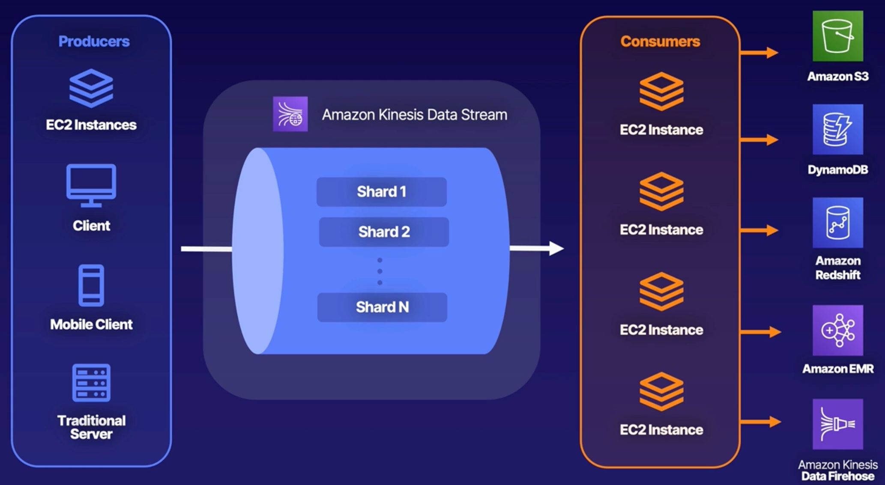
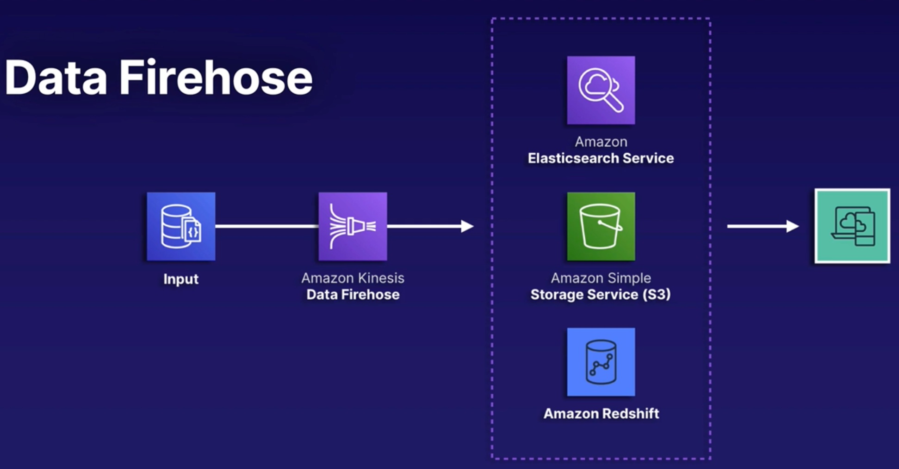
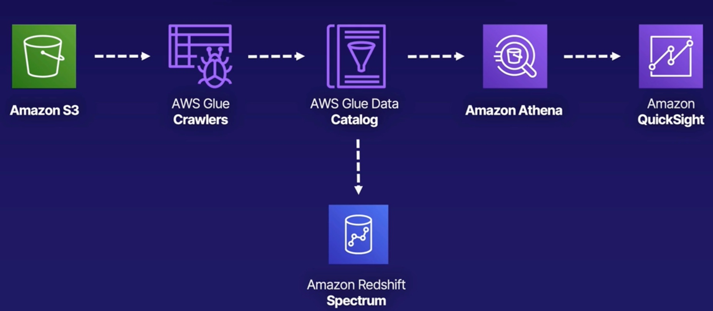

# Big Data

The `3 V's` of big data:
- Volume:
  - Ranges from terabytes to petabytes of data.
- Variety:
  - Includes data from a wide range of sources and formats.
- Velocity:
  - Businesses require speed; data needs to be collected, stored, processed, and analysed within a short period of time.

## Exploring large Redshift databases

Redshift is a fully managed, petabyte-scale data warehouse service in the cloud.
It's a very large relational database traditionally used in big data applications.

Redshift is where you can store massive amounts of data:
- Size:
  - Redshift can hold up to 16 PB of data; this means you don't have to split up your large datasets.
- Relational:
  - This database is relational; use your standard SQL and business intelligence (BI) tools to interact with it.
- Usage:
  - While Redshift is a fantastic tool for BI applications, it is not a replacement for standard RDS databases.

## Processing data with EMR (Elastic MapReduce)

ETL = Extract, Transform, Load

EMR is there to help us with this ETL process.

EMR is a managed big data platform that allows you to process vast amounts of data using open source tools such as Spark, Hive, HBase, Flink, Hudi, and Presto.
It is AWS's ETL tool. In a nutshell, EMR is a managed fleet of EC2 instances running open source tools.

- EC2 rules apply:
  - You can use RIs (reserved instances) and Spot instances to reduce cost.
- VPC:
  - The architecture lives inside a VPC.

## Streaming data with Kinesis

Kinesis allowd you to ingest, process, and analyse real-time streaming data.
You can think of it as a huge data highway connected to your AWS account.

There are 2 major types of Kinesis:

| Data Streams                                                                            | Data Firehose                                                                                |
|-----------------------------------------------------------------------------------------|----------------------------------------------------------------------------------------------|
| **Purpose**: Real-time streaming for ingesting data                                 | **Purpose**: Data transfer tool to get information to S3, Redshift, Elastisearch, Splunk |
| **Speed**: Real time                                                                | **Speed**: Near real time (withing 60 secs)                                              |
| **Difficulty**: You're responsible for creating the consumer and scaling the stream | **Difficulty**: Plug and play with AWS architecture                                      |

Kinesis Data Streams is a lot of work compared to Firehose e.g. coding all the necessary consumers.
But there is a lot of work because you have complete control:

Kinesis data analytics - Analyse data using standard SQL:
- Easy:
  - It's very simple to tie data analytics into your Kinesis pipeline; it's directly supported by Firehose and Streams.
- No servers:
  - This is a fully managed real-time serverless service; it will automatically handle scaling and provisioning of needed resources.
- Cost:
  - You only pay for the amount of resources you consume as your data passes through.

Why would you use Kinesis instead of SQS?
Kinesis (unlike SQS) is real-time, and you would want to use it with big data.
 
## Amazon Athena and AWS Glue

What is Athena?
- Athena is a serverless interactive query service that makes it easy to analyse data in `S3` using `SQL`.
- This allows you to directly query data in your S3 bucket without loading it into a database.

What is Glue?
- Glue is a serverless data integration service that makes it easy to discover, prepare, and combine data.
- It allows you to perform ETL workloads without managing underlying servers.
- Glue can be used instead of EMR.

## Visualing data with QuickSight

What is QuickSight?
- Amazon QuickSight is a fully managed business intelligence (BI) data visualisation service.
- It allows you to easily create dashboards and share them within your company.

## Moving transformed data using AWS Data Pipeline

AWS Data Pipeline is a managed `Extract, Transform, Load (ETL)` service for automating movement and transformation of your data.

- Data Driven
  - Define data-driven workflows; steps are dependent on previous tasks completing successfully.
- Parameters
  - Define your parameters for data transformations; AWS Data Pipeline enforces your chosen logic.
- Highly available
  - AWS hosts the infrastructure on highly available and distributed infrastructure; also fault tolerant.
- Handling failures
  - Automatically retries failed activities; configure notifications via Amazon SNS for failures (or even successful tasks).
- AWS storage services
  - Integrates easily with Amazon DynamoDB, Amazon RDS, Amazon Redshift, Amazon S3.
- AWS Compute
  - Works with Amazon EC2 and Amazon EMR for compute needs.

- Pipeline definition
  - Specify the business logic of your data management needs.
- Managed Compute
  - Service will create EC2 instances to perform you activities; or leverage existing EC2.
- Task Runners
  - Task runners (EC2) poll for different tasks and perform them when found.
- Data nodes
  - Define the locations and types of data that will be input and output.

Popular use cases:
- Processing data in EMR using Hadoop streaming.
- Importing or exporting DynamoDB data.
- Copying CSV files or data between S3 buckets.
- Exporting RDS data to S3.
- Copying data to Redshift.

## Implementing Amazon Managed Streaming for Apache Kafka (Amazon MSK)

- Apache Kafka
  - Fully managed service for running data streaming applications that leverage Apache Kafka.
- Control plane
  - Provides control-plane operations; creates, updates and deletes clusters as required.
- Data plane
  - Leverage Kafka data-plane operations for producing and consuming streaming data.
- Existing applications
  - Open-source versions of Apache Kafka allow support for existing apps, tools and plugins.

- Broker nodes
  - Specify the amount of broker nodes per AZ you want at time of cluster creation.
- ZooKeeper nodes
  - ZooKeeper nodes are created for you.
- Producers, consumers and topics
  - Kafka data-plane operations allow creation of topics and ability to produce/consume data.
- Flexible cluster operations
  - Perform cluster operations with the console, AWS CLI or APIs within any SDK.

- Automatic recovery
  - Automatic detection and recovery from common failure scenarios.
- Detection
  - Detected broker failures result in mitigation or replacement of unhealthy nodes.
- Reduce data
  - Tries to reuse storage from older brokers during failures to reduce data needing replication.
- Time required
  - Impact time is limited to however long it takes Amazon MSK to complete detection and recovery.
- After recovery
  - After successul recovery, producer and consumer apps continue to communicate with the same broker IP as before.

- MSK serverless
  - Cluster type within Amazon MSK offering serverless cluster management; automatic provisioning and scaling.
- Fully compatible
  - MSK serverless is fully compatible with Apache Kafka; use the same client apps for producing and consuming data.
- MSK connect
  - Allows developers to easily stream data to and from Apache Kafka clusters.

Security and logging:
- Integration with Amazon KMS for SSE requirements.
- Encryption at rest by default.
- TLS 1.2 for encryption in transit between brokers in clusters.
- Deliver broker logs to Amazon CloudWatch, Amazon S3, Amazon Kinesis Data Firehose.
- Metrics are gathered and sent to CloudWatch.
- All Amazon MSK API calls are logged to AWS CloudTrail.

## Analysing data with Amazon OpenSearch service
