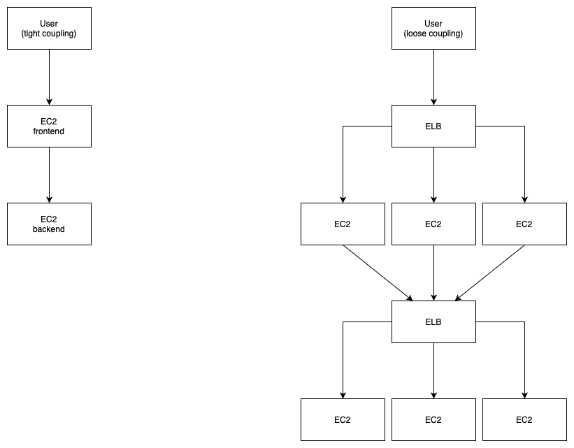
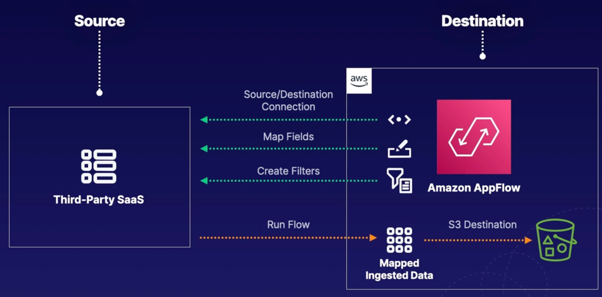

# Decoupling Workflows



There are other ways to decouple and avoid using an ELB:
- Simple Queue Service (SQS):
  - A fully managed message queuing service that enables you to decouple and scale microservices, distributed systems and serverless applications.
- Simple Notification Service (SNS):
  - A fully managed messaging service for both application-to-application (A2A) and application-to-person (A2P) communication.
- API Gateway:
  - A fully managed service that makes it easy for developers to create, publish, maintain, monitor, and secure APIs at any scale.

## Messaging with SQS

Simple Queue Service is a messaging queue that allows `asynchronous` processing of work.
One resource will write a message to a SQS queue, and then another resource will retrieve that message from SQS.

SQS settings:
- Delivery delay: Default is 0; can be set up to 15 minutes.
- Message size: Can be up to 256KB of text in any format.
- Encryption: Messages are encrypted in transit by default; but you can add at-rest.
- Message retention: Default is 4 days; can be set between 1 minute and 14 days.
- Long vs short polling: Short is default.
  - Short: Connect; check for messages; disconnect; and repeat (not efficient and wastes money).
  - Long: Much better - Connect; wait a set amount of time for messages; then disconnect.
- Queue depth: This can a trigger for autoscaling. Best to set up a `CloudWatch` alarm to monitor queue depth.
- Visibility timeout:
  - A resource polls and sees a message - the message is pulled for processing but not immediately removed from the queue.
  - While the message is being processed, the message remains hidden on the queue for 30 seconds i.e. no one else can pick it up.
  - If the message is successfully processed, the resource can let SQS know, and SQS can delete the message.
  - However, the the resource maybe goes down, after the 30 second timeout, the message can be picked up by any other resource.

Sidelining messages with dead-letter queues:
- Say a consumer cannot process a message. Say the message is invalid.
- We could retry the message, but that won't change a thing (we can set a retry count), and then we'll end up in a loop, until the message expires and is deleted.
- Instead, we can have the message off-loaded to a `dead letter` queue, when a message cannot be processed.

Ordered messages with SQS FIFO:
```
Standard:                                             FIFO
message 1 --->                                        message 1 --->
message 2 --->                                        message 2 --->
message 3 --->                                        message 3 --->
message 4 --->                                        message 4 --->
                SQS                                                   SQS
                     ---> message 2                                       ---> message 1
                     ---> message 1                                       ---> message 2
                     ---> message 3                                       ---> message 3
                     ---> message 4                                       ---> message 4
                     ---> message 4
```
FIFO guarantees ordering and no duplicate messages.
What's the catch compared to standard? You are limited to 300 messages per second and of course, cost more.
FIFO messages need a `message group ID` that ensures messages are processed one by one.

## Delivering messages with SNS

Simple Notification Service is `pushed based messaging` as opposed to `poll based` used by SQS.

SNS is a pushed based messaging service, whereby it will proactively deliver messages to the endpoints `subscribed` to it.
This can be used to alert a system or a person.

- Subscribers - What is subscribed to your SNS topic?
  - E.g. Kinesis Data Firehose, SQS, Lambda, email, Http(s), SMS, platform application endpoint.
  - Note, only retries work with Http(s), otherwise a failed notification can go to a DLQ.
- Message size:
  - Messages can be up to 256KB of text in any format.
- DLQ support:
  - Messages that fail to be delivered can be stored in a SQS DLQ.
- FIFO or standard:
  - FIFO only supports SQS as a subscriber.
- Encryption:
  - Messages are encrypted in transit by default, but you can add at-rest.
- Access policy:
  - A resource policy can be added to a topic, similar to S3.

## Fronting applications with API Gateway

Amazon API Gateway is a fully managed service that allows you to easily publish, create, maintain, monitor, and secure your API.
It allows you to put a safe `front door` on your application.

Features:
- Security:
  - This service allows you to easily protect your endpoints by attaching a web application firewall (WAF).
- Stop abuse:
  - Users can easily implement DDos protection and rate limiting to curb abuse of their endpoints.
- Ease of use:
  - API Gateway is simple to get started with; easily build out the calls that will kick off other AWS services in your account.

## Executing batch workloads using AWS Batch

What is AWS Batch?
- Batched workloads:
  - Allows you to run batch computing workloads within AWS (run on EC2 or ECS/Fargate).
- Makes things simpler:
  - Removes any heavy lifting for configuration and management of infrastructure required for computing.
- Automatically provision and scale:
  - Capable of provisioning accurately sized compute resources based on number of jobs submitted, and optimises the distribution of workloads.
- No install required:
  - Allows you to skip installation and maintenance of batch computing software, so you can focus on obtaining and analysing the results.

4 main components to Batch:
- Jobs:
  - Units of work that are submitted to Batch e.g. shell scripts, executables, and Docker images.
- Job definitions:
  - Specify how your jobs are to be run (essentially, the blueprint for the resources in the job).
- Job queues:
  - Jobs get submitted to specific queues and reside there until scheduled to run in a compute environment.
- Compute environment:
  - Set of managed or unmanaged compute resources used to run your jobs.

Fargate is the recommended way of launching most batch jobs... but sometimes, EC2 is the best choice when:
- Custom AMI is needed:
  - Custom AMIs can only be run via EC2.
- vCPU requirements:
  - Anything needing more than 4 vCPUs needs to use EC2.
- Memory requirements:
  - EC2 is recommended for anything needing more that 30GiB of memory.
- GPU or Graviton CPU:
  - If your jobs require a GPU, then it must be on EC2; Arm-based Graviton CPU can only be leveraged via EC2 for Batch.
- linuxParameters:
  - When using linuxParameters you must run on EC2 compute.
- Number of jobs:
  - For a large number of jobs, it's best to run on EC2; dispatched at a higher rate (more concurrency) than Fargate.

AWS Batch OR AWS Lambda?
- Time limits:
  - Lambda currently has a 15 minute execution time limit; Batch does not have this.
- Disk space:
  - Lambda has limited disk space, and EFS requires functions live within a VPC.
- Runtime:
  - Lambda is fully serverless, but it has natively limited runtimes!
  - Batch runtimes are not limited; Batch used Docker, so any runtime can be used.

| Managed                                                                          | Unmanaged                                         |
|----------------------------------------------------------------------------------|---------------------------------------------------|
| AWS manages capacity and instance types.                                         | You manage your own resources.                    |
| Compute resource specs are defined when environment is created.                  | AMI must meet Amazon ECS AMI specs.               |
| ECS instances are launched into VPC subnets.                                     | Good choice for complex or specific requirements. |
| Default is the most recent and approved ECS AMI (use your own within ECS rules). |                                                   |
| Leverage Fargate, Fargate Spot, and regular Spot instances.                      |                                                   |

## Brokering messages with Amazon MQ

- Message broker:
  - Message broker (managed) service allowing easier migration of existing applications to the AWS cloud.
- Variety:
  - Leverage multiple programming languages, operating systems, and messaging protocols (JMS, AMQP, MQTT, OpenWire, STOMP).
- Engine types:
  - Currently supports both `Apache ActiveMQ` and `RabbitMQ` engine types.
- Managed service:
  - Allows you to easily leverage existing apps without managing and maintaining your own system.

Why use Amazon MQ vs SNS with SQS?
- Topics and queues:
  - Each offers architectures with topics and queues; allows for `one-to-one` or `one-to-many` messaging designs.
- Existing applications:
  - If migrating existing applications with messaging systems in place, you likely want to consider Amazon MQ.
- New applications:
  - If creating new applications, look at SNS and SQS; simpler to use, highly scalable, and simple APIs.
- Public accessible?
  - Amazon MQ requires private networking like VPC, Direct Connect, or VPN; SNS and SQS are publicly accessible by default.
  - NOTE Amazon MQ has no default AWS integrations (unlike SNS/SQS).

Configuring brokers:
- Single instance broker:
  - One broker lives within one AZ; perfect for DEV environment; note RabbitMQ has a network load balancer in front.
- Highly available:
  - Amazon MQ offers highly available architectures to minimise downtime during maintenance; architecture depends on the broker engine type.
- Amazon MQ for ActiveMQ:
  - With active/standby deployments, one instance will remain available at all times; configure network of brokers with separate maintenance windows.
- Amazon MQ for RabbitMQ:
  - Cluster deployments are logical groupings of 3 broker nodes across multiple AZs sitting behind a network load balancer.

## Coordinating distributed Apps with AWS Step Functions.

- Orchestration:
  - Serverless orchestration service combining different AWS services for business applications.
- Graphical console:
  - Comes with a graphical console for easier application workflow views and flows.
- Components:
  - Main components are state machines and tasks.
- State machine:
  - A particular workflow with different event-driven steps.
- Task:
  - Specific states within a workflow (state machine) representing a single unit of work.
- States:
  - Every single step within a workflow is considered a state.

AWS Step Functions have 2 different types of workflows: Standard and Express.

Each workflow has executions.
Executions are instances where you run your workflows in order to perform your tasks.

| Standard                                                         | Express                                                           |
|------------------------------------------------------------------|-------------------------------------------------------------------|
| Have an exactly-once execution                                   | At-least-once workflow execution                                  |
| Can run for up to 1 year                                         | Can run for up to 5 minutes                                       |
| Useful for long running workflows that need an auditable history | Useful for high event rate workflows                              |
| Rates up to 2,000 executions per second                          | Example use is IoT data streaming and ingestion                   |
| Pricing based per state transition                               | Pricing based on number of executions, durations, memory consumed |

States and state machines:
- Flexible:
  - Leverage states to either make decisions based on input, perform certain actions, or pass output.
- Language:
  - States and workflows are defined in Amazon States Language (ASL).
- States:
  - States are elements within your state machines; they are referred to by a name.
- Example:
  - Thinks about an online pickup order: Each step in that workflow is considered a state.

Some integrated AWS services:
- Lambda
- Batch
- DynamoDB
- ECS/Fargate
- SNS
- SQS
- API Gateway
- EventBridge

Different states:
- Pass: Passes any input directly to its output (no work done).
- Task: Single unit of work performed (e.g. Lambda, Batch, SNS).
- Choice: Adds branching logic to state machines.
- Wait: Creates a specified time delay within the state machine.
- Succeed: Stops executions successfully.
- Fail: Stops executions and marks them as failures.
- Parallel: Runs parallel branches of executions within state machines.
- Map: Runs a set of steps based on elements of an input array.

## Ingesting data from SaaS applications to AWS with Amazon AppFlow

What is AppFlow?
- Integration:
  - Fully managed integration service for exchanging data between SaaS apps and AWS services.
- Ingest data:
  - Pulls data records from third-party SaaS vendors and stores them in S3.
- Bi-directional:
  - Bi-directional data transfers with limited combinations.

Concepts:
- Flow:
  - Flows transfer data between sources and destinations; a variety of SaaS applications are supported.
- Data mapping:
  - Determines how your source data is stored within your destinations.
- Filters:
  - Criteria to control which data is transferred from a source to a destination.
- Trigger:
  - How the flow is started.
  - Supported types: run on demand; run on event; run on schedule.



Use cases:
- Transferring Salesforce records to Amazon Redshift.
- Ingesting and analysing Slack conversations in S3.
- Migrating Zendesk and other help desk support tickets to Snowflake.
- Transferring aggregate data on a scheduled basis to S3.