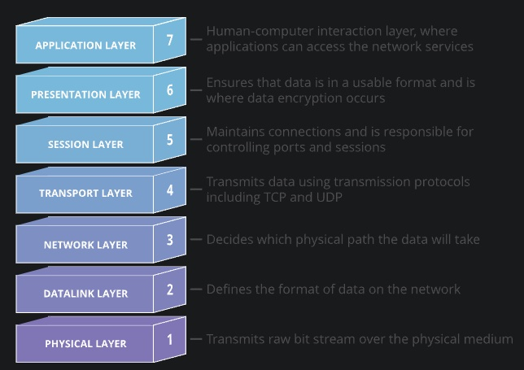
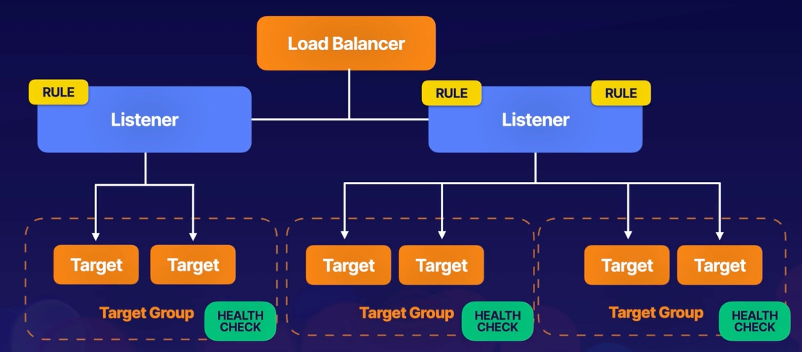
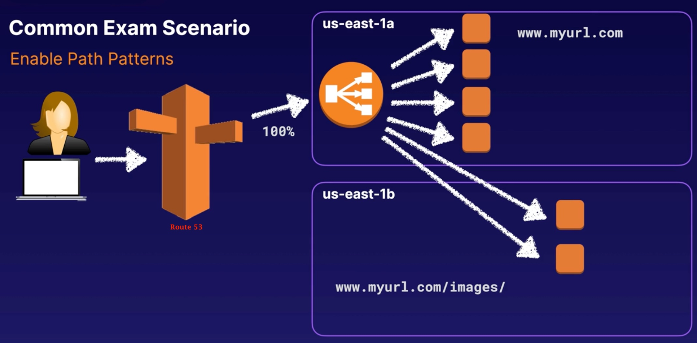

# Elastic Load Balancing (ELB)

Elastic Load Balancing automatically distributes incoming application traffic across multiple targets, such as EC2 instances.
This can be done across multiple AZs.

3 types of load balancers:
- Application load balancer (intelligent load balancer).
  - Best suited for load balancing of HTTP/HTTPS traffic; they operate at `layer 7` and are application-aware.
  - Limitation: Only supports `HTTP` and `HTTPS`.
- Network load balancer (performance load balancer).
  - Operating at the connection level (`layer 4`), capable of handling millions of requests per second, while maintaining ultra-low latencies.
- Classic load balancer (classic/test/dev legacy load balancer).
  - Can load balance HTTP/HTTPS applications and use `layer 7` specific features such as `X-Forwarded` and sticky sessions.

Health checks:
- All AWS load balancers can be configured with health checks.
- Health checks periodically send requests to load balancers' registered instances to test their status.
- The status of the instances that are healthy at the time of the health check is `InService`.
- The status of any instance that is unhealthy at the time of the health check is `OutOfService`.
- The load balancer routes requests only to the healthy instances.

## Using application load balancers

An application load balancer functions at the `application layer` - the seventh layer of the `Open Systems Interconnection (OSI) model`.
After the load balancer receives a request, it evaluates the listener rules in priority order to determine which rule to apply,
and then selects a target from the target group for the rule action.

Listeners:
- A listener checks for connection requests from clients, using the protocol and port you configure.
- You define rules that determine how the load balancer routes requests to its registered targets.
- Each rule consists of a priority, one or more actions, and one or more conditions.
- You must define a default rule for each listerner, and then you can optionally define additional rules.

Target groups:
- Each target group routes requests to one or more registered targets, such as EC2 instances, using the protocol and port number you specify.

HTTPS load balancing:
- To use a HTTPS listener, you must deploy at least one `SSL/TLS` server certificate on your load balancer.
- The load balancer uses a server certificate to terminate the frontend connection and then decrypt requests from clients before sending them to the targets.

If your domain is registered with Route 53, that service will generate the certificate for you (they are a certificate signing authority) for you to add said certificate to your application load balancer.

## Example

Take a look at the terraform under [elb](../terraform/elb/main.tf) as an example of load balancing 3 EC2 instances.
As well as using previous terraform examples within this project, I followed along with the excellent article [How to Deploy a Set of EC2 Instances behind an ALB Using Terraform](https://aws.plainenglish.io/deploy-a-set-of-ec2-instances-behind-an-alb-using-terraform-403fe584f09e).

==========================================
AT 7:40 of video
setup terraform with elb for http
duplicate and try with my domain and https
==========================================
