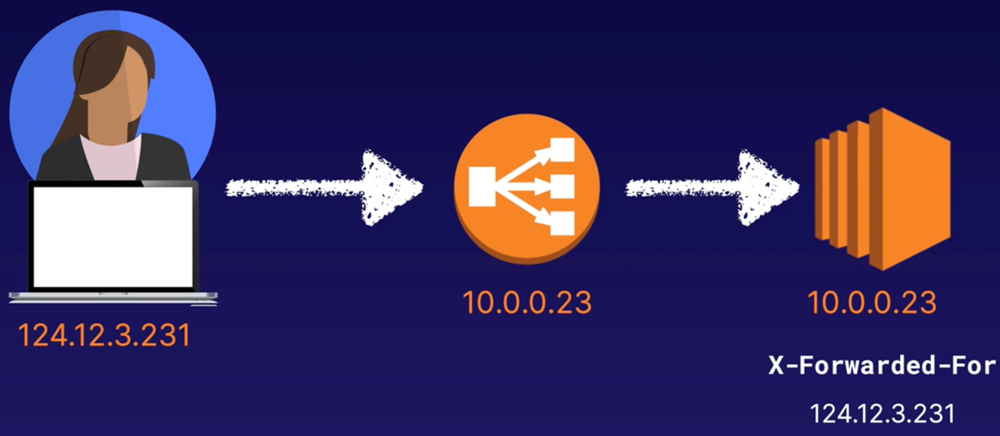

# Elastic Load Balancing (ELB)

Elastic Load Balancing automatically distributes incoming application traffic across multiple targets, such as EC2 instances.
This can be done across multiple AZs.

3 types of load balancers:
- Application load balancer (intelligent load balancer).
  - Best suited for load balancing of HTTP/HTTPS traffic; they operate at `layer 7` and are application-aware.
  - Limitation: Only supports `HTTP` and `HTTPS`.
  - Intelligent routing such as allowing for `path pattern rules` to decide where to route to.
- Network load balancer (performance load balancer).
  - Operating at the connection level (`layer 4`), capable of handling millions of requests per second, while maintaining ultra-low latencies.
- Classic load balancer (classic/test/dev legacy load balancer).
  - Can load balance HTTP/HTTPS applications and use `layer 7` specific features such as `X-Forwarded` and sticky sessions.

Health checks:
- All AWS load balancers can be configured with health checks.
- Health checks periodically send requests to load balancers' registered instances to test their status.
- The status of the instances that are healthy at the time of the health check is `InService`.
- The status of any instance that is unhealthy at the time of the health check is `OutOfService`.
- The load balancer routes requests only to the healthy instances.

## Using application load balancers

An application load balancer functions at the `application layer` - the seventh layer of the `Open Systems Interconnection (OSI) model`.
After the load balancer receives a request, it evaluates the listener rules in priority order to determine which rule to apply,
and then selects a target from the target group for the rule action.

Listeners:
- A listener checks for connection requests from clients, using the protocol and port you configure.
- You define rules that determine how the load balancer routes requests to its registered targets.
- Each rule consists of a priority, one or more actions, and one or more conditions.
- You must define a default rule for each listerner, and then you can optionally define additional rules.

Target groups:
- Each target group routes requests to one or more registered targets, such as EC2 instances, using the protocol and port number you specify.

HTTPS load balancing:
- To use a HTTPS listener, you must deploy at least one `SSL/TLS` server certificate on your load balancer.
- The load balancer uses a server certificate to terminate the frontend connection and then decrypt requests from clients before sending them to the targets.

If your domain is registered with Route 53, that service will generate the certificate for you (they are a certificate signing authority) for you to add said certificate to your application load balancer.

## Example

Take a look at the terraform under [elb](../terraform/elb/main.tf) as an example of load balancing 3 EC2 instances.
As well as using previous terraform examples within this project, I followed along with the excellent article [How to Deploy a Set of EC2 Instances behind an ALB Using Terraform](https://aws.plainenglish.io/deploy-a-set-of-ec2-instances-behind-an-alb-using-terraform-403fe584f09e).

## Extreme performance with network load balancers

A network load balancer functions at the 4th layer of the Open Systems Interconnection (OSI) model.
It can handle millions of requests per second.

A listener checks for connection requests from clients, using the protocol and port you configure.
The listener on a network load balancer then forwards the request to the target group.
`There are no rules, unlike with application load balancers`.

Supported protocols:
- TCP
- TLS
- UDP
- TCP_UDP

Supported ports:
- 1 to 65535

Encryption:
- You can use a TLS listener to offload the work of encryption/decryption to your load balancer so your applications can focus on their business logic.

NOTE: If the listener protocol is TLS, you must deploy exactly one SSL server certificate on the listener.

## Using classic load balancers

These are legacy load balancers.
You can laod balance HTTP/HTTPS applications and use Layer 7 specific features such as `X-Forwarded-For` and `sticky sessions`.
You can also use strict Layer 4 load balancing for applications that rely purely on the TCP protocol.

X-Forwarded-For:
- When traffic is sent from a load balancer, the server access logs contain the IP address of the proxy or load balancer only.
- To see the original IP address of the client, the `X-Forwarded-For` request header is used.

Gateway timeouts:
- If your application stops responding, the classic load balancer responds with a 504 error.

## Sticky sessions

Classic load balancers route each request independently to the registered EC2 instance with the smallest load.

`Sticky sessions` allow you to bind a user's session to a specific EC2 instance.
However, you may want to disable sticky sessions because if a specific EC2 instance goes down, the LB will continue to direct traffic to that instance.

## Leaving the load balancer with Deregistration Delay

Deregistration delay allows load balancers to keep existing connections open if the EC2 instances are de-registered or become unhealthy.
This enables the load balancer to complete in-flight requests made to instances that are de-registering or unhealthy.