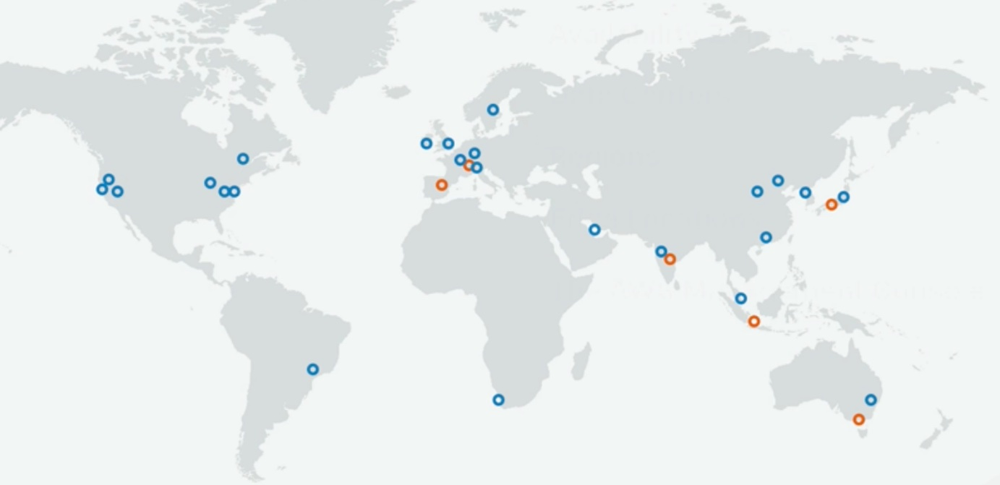

# Fundamentals

## Availability Zones and Regions

A `region` is a location such as `Cape Town` or `London`:

Next, think of an `availability zone` as a `data centre` (where a data centre is just a building filled with `servers`).
An AZ can have multiple data centres (but still classed as 1 AZ).

So each `region` (geographical area) is made up of at least 2 AZs.

There are also `edge locations` which are endpoints for AWS that are used for caching content.
Typically this consists of `CloudFront` which is Amazon's content delivery network (CDN) - and there are many more than regions.

## Shared Responsibility Model

- Customer: Responsibility for security `in` the cloud
  - Customer data; applications; IAM, network and firewall configuration; client and server side and network encryption
- AWS: Responsibility for security `of` the cloud
  - Hardware and infrastructure including regions; availability zones, edge locations

How do you know who is responsible for what? Well, if you answer `yes` to the following question, then it's the customer's responsibility:

Can you do this yourself in the AWS management console?
- Yes to (therefore a customer responsibility):
  - Security groups
  - IAM users
  - Patching EC2 operation systems
  - Patching databases running on EC2
  - etc.
- No to (therefore an AWS responsibility):
  - Management of data centres
  - Security cameras
  - Cabling
  - Patching RDS operating systems
  - etc.

Note that `encryption` is a shared responsibilty (of the shared responsibility model).

## Compute, Storage, Databases and Networking

- Compute
  - You wouldn't be able to build an application without compute power - you need something crunching the data:
    - EC2
    - Lambda
    - Elastic Beanstalk
- Storage
  - Think of storage as a giant disk in the cloud:
    - S3
    - EBS
    - EFS
    - FSx
    - Storage Gateway
- Databases
  - Easiest way to think of a database is a spreadsheet - it's a reliable way to store and retrieve information:
    - RDS
    - DynamoDB
    - Redshift
- Networking
  - We need a way for our compute, storage, and databases to communicate and even a place for them to live - this is where networking comes in:
    - VPCs
    - Direct Connect
    - Route 53
    - API Gateway
    - AWS Global Accelerator

## Well-Architected Framework

- Operational Excellence
  - Focuses on running and monitoring systems to deliver business value, and continually improving processes and procedures.
- Security
  - Focuses on protecting information and systems.
- Reliability
  - Focuses on ensuring a workload performs its intended function correctly and consistently when it's expected to.
- Performance Efficiency
  - Focuses on using IT and computing resources efficiently.
- Cost optimisation
  - Focuses on avoiding unnecessary costs.