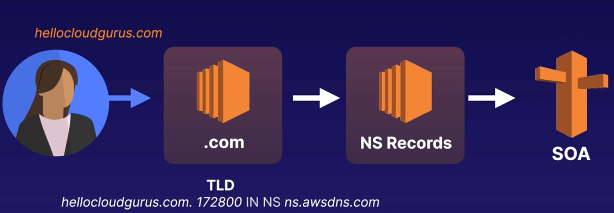

# Route 53

What is DNS?
- DNS is used to convert human-friendly domain names (e.g. http://blah.com) into an Internet Protocol (IP) address (e.g. http://82.124.53.1).
- IP addresses are used by computers to identity each other on the network (there is IPv4 and IPv6).
  - IPv4 space is a 32-bit field and has over 4 billion different addresses.
  - IPv6 solves the depletion address issue of IPv4 and has an address space of 128 bits (about 340 undecillion).

Domain name examples:
- google.com
- bbc.co.uk

The last word in a domain name (`com`, or `uk` etc.) represents the top-level domain, as listed by [iana](https://www.iana.org/domains/root/db).
The second (optional) word in a domain name is known as a second-level domain name (e.g. `co`).

Because all names in a given domain name must be unique, there needs to be a way to organise this so that domain names are not duplicated.
This is where `domain registrars` come in.
A registrar is an authority that can assign domain names directly under one or more top-level domains.

Examples of well known registrars:
- domain.com
- GoDaddy
- Hoover
- AWS
- Namecheap

Common DNS Record Types:
- SOA (Start of Authority) which stores information about:
  - The name of the server that supplied the data for the zone.
  - The administrator of the zone.
  - The current version of the data file.
  - The default number of seconds for the time-to-live file on resource records.

NS (name server) records are used by the top-level domain servers to direct traffic to the content DNS server that contains the authoritative DNS records.

`A` Record:
- An `A` (or address) record is the fundamental type of DNS record.
- The `A` record is used by a computer to translate the name of the domain to an IP address.
- E.g. [http://blah.com]() might point to [http://123.10.10.80]().

What is TTL?
- The length that a DNS record is cached on either the resolving server or the user's own local PC is equal to the value of the `time to live (TTL)` in seconds.
- The lower the time to live, the faster changes to DNS records take to propagate throughout the internet.

What is CNAME?
- A `CNAME` (canonical name) can be used to resolve one domain name to another.
- E.g. you may have a mobile website with the domain name [http://blah.com]() that is used for when users browse to your domain name on their mobile devices.

What are Alias Records (specific to AWS e.g. not GoDaddy)?
- Alias records are used to map resource record sets in you hosted zone to load balancers, CloudFront distributions, or S3 buckets that are configured as websites.
- Alias records work like a CNAME record in that you can map one DNS name [www.blah.com]() to another `target` DNS name [elb123.elb.amazonaws.com]().

There are 7 routing policies available with `Route 53`:
- Simple routing
- Weighted routing
- Latency-based routing
- Failover routing
- Geolocation routing
- Geoproximity routing
- Multivalue answer routing

## Register a domain name

Let's provision 2 EC2 instances with [terraform]().