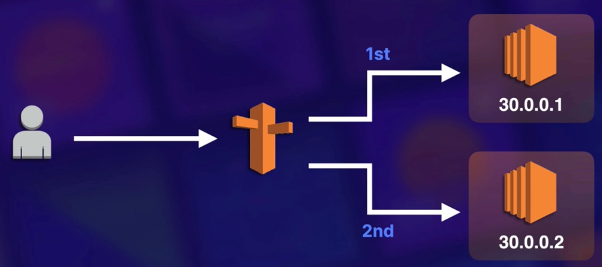
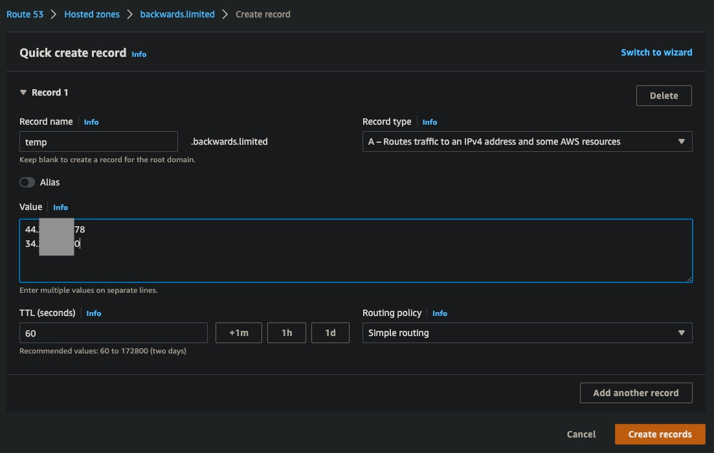

# Route 53

What is DNS?
- DNS is used to convert human-friendly domain names (e.g. http://blah.com) into an Internet Protocol (IP) address (e.g. http://82.124.53.1).
- IP addresses are used by computers to identity each other on the network (there is IPv4 and IPv6).
  - IPv4 space is a 32-bit field and has over 4 billion different addresses.
  - IPv6 solves the depletion address issue of IPv4 and has an address space of 128 bits (about 340 undecillion).

Domain name examples:
- google.com
- bbc.co.uk

The last word in a domain name (`com`, or `uk` etc.) represents the top-level domain, as listed by [iana](https://www.iana.org/domains/root/db).
The second (optional) word in a domain name is known as a second-level domain name (e.g. `co`).

Because all names in a given domain name must be unique, there needs to be a way to organise this so that domain names are not duplicated.
This is where `domain registrars` come in.
A registrar is an authority that can assign domain names directly under one or more top-level domains.

Examples of well known registrars:
- domain.com
- GoDaddy
- Hoover
- AWS
- Namecheap

Common DNS Record Types:
- SOA (Start of Authority) which stores information about:
  - The name of the server that supplied the data for the zone.
  - The administrator of the zone.
  - The current version of the data file.
  - The default number of seconds for the time-to-live file on resource records.

NS (name server) records are used by the top-level domain servers to direct traffic to the content DNS server that contains the authoritative DNS records.

`A` Record:
- An `A` (or address) record is the fundamental type of DNS record.
- The `A` record is used by a computer to translate the name of the domain to an IP address.
- E.g. [http://blah.com]() might point to [http://123.10.10.80]().
- So, essentially turn a (translate) domain name into an IP.

What is TTL?
- The length that a DNS record is cached on either the resolving server or the user's own local PC is equal to the value of the `time to live (TTL)` in seconds.
- The lower the time to live, the faster changes to DNS records take to propagate throughout the internet.

What is CNAME?
- A `CNAME` (canonical name) can be used to resolve one domain name to another.
- E.g. you may have a mobile website with the domain name [http://blah.com]() that is used for when users browse to your domain name on their mobile devices.

What are Alias Records (specific to AWS e.g. not GoDaddy)?
- Alias records are used to map resource record sets in you hosted zone to load balancers, CloudFront distributions, or S3 buckets that are configured as websites.
- Alias records work like a CNAME record in that you can map one DNS name [www.blah.com]() to another `target` DNS name [elb123.elb.amazonaws.com]().

In AWS you should prefer `alias` over `cname`.
Essentially an `alias` is a way of translating a naked domain name to a resource (an ELB, S3 bucket etc.).
However, `cname` only translates a (sub) domain name to another.

There are 7 routing policies available with `Route 53`:
- Simple routing
- Weighted routing
- Latency-based routing
- Failover routing
- Geolocation routing
- Geoproximity routing
- Multivalue answer routing

## Register a domain name

Let's provision 2 EC2 instances with [terraform]().

## Using a simple routing policy

Carrying on from the Terraform example of registering a domain (where we didn't go through the motions of actually registering, as it's a DIY).

If you choose the simple routing policy, you can only have `one record with multiple IP addresses`.
If you specify `multiple values in a record`, Route 53 returns `all values` to the user in a `random order`.

E.g. a user accesses (by typing in our domain name) our service whereby Route 53 could say (in our scenario) randomly select which of the 2 IP addresses to route to.

#### Creating record in AWS console

We can create a new record for our IPs (see IPs output from the Terraform) in AWS console or with Terraform. First we will try out the AWS console.

## Weighted routing policy

This allows you to split your traffic based on different weights assigned.

E.g. you can set 10% of your traffic to go to `us-east-1` and 90% to go to `eu-west-1`.

## Failover routing policy

Failover routing policies are used when you want to create an active/passive set up, e.g.

You may want your primary site to be in `eu-west-2` and your secondary `DR` site in `ap-southeast-2`.
Route 53 will monitor the health of your primary site using a health check.

## Geolocation routing policy

Geolocation routing lets you `choose where your traffic will be sent` based on the geographic location of your users (i.e. the location from which DNS queries originate).

## Geoproximity routing policy

You can use Route 53 traffic flow to build a routing system that uses a combination of:
- geographic location
- latency
- and availability to route traffic

from your users to your cloud or on-premises endpoints.

You can build your traffic routing policies:
- from scatch
- or you can pick a template from a library and then customise it.

One way to customise is to use a `bias` which expands or shrinks the size of the geographic region from which traffic is routed to a resource.

## Latency routing policy

Allows you to route your traffic based on `the lowest network latency for your end user` (i.e. which region will give them the fastest response time).

## Multivalue anwser routing policy

Multivalue answer routing lets you `configure Route 53 to return multiple values`, such as IP addresses for your web servers, in response to DNS queries.

Multivalue answer routing lets you check the health of each resource, so Route 53 returns only values for healthy resources.