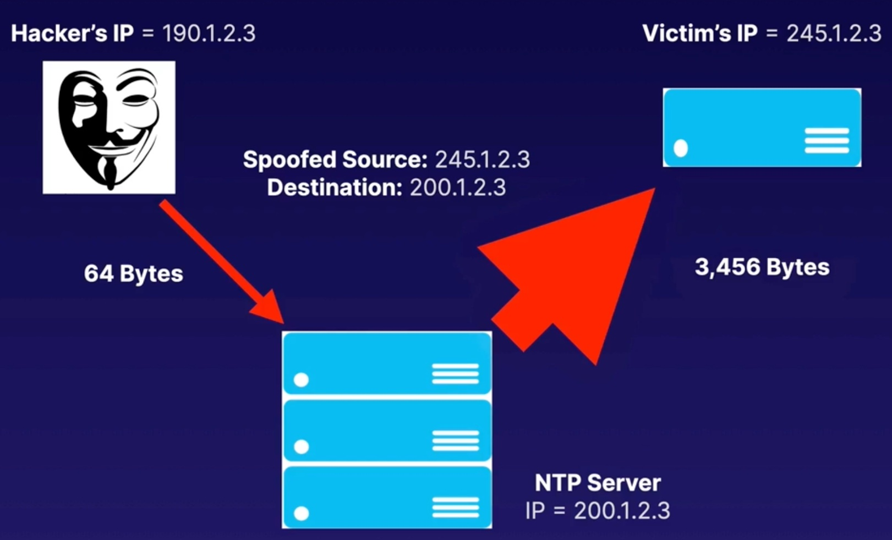

# Security

## DDoS

A Distributed Denial of Service (DDoS) attack is an attack that attempts to make your website or application unavailable to your end users.
This can be achieved by multiple mechanisms, such as large packet floods, by using a combination of reflection and amplification techniques, or by using large botnets.

SYN flood attack i.e. Layer 4 DDoS attack:
- A layer 4 DDoS attack is often referred to as a `SYN flood`; it works at the transport layer (TCP).
- To establish a TCP connection a 3-way handshake takes place; the client sends a SYN packet to a server, the server replies with a SYN-ACK, and the client then responds to that with an ACK.
- What should happen?
  - After the 3-way handshake is complete, the TCP connection is established; after this, applications begin sending data using Layer 7 (application layer protocol), such as HTTP etc.
- SYN floods:
  - A SYN flood uses the built in patience of the TCP stack to overwhelm a server by sending a large number of SYN packets and then ignoring the SYN-ACKs returned by the server.
  - This causes the server to use up resources waiting for a set amount of time for the anticipated ACK that should come from a legitimate client.
- What can happen?
  - There are only so many concurrent TCP connections that a web or application server can have open, so if an attacker sends enough SYN packets to a server, it can easily eat through the allowed number of TCP connections.
  - This then prevents legitimate requests from being answered by the server.

Amplification attack:
- Amplification/reflection attacks can include things such as NTP, SSDP, DNS, CharGEN, SNMP attacks, etc.
- This is where an attacker may send a third-party server (such as an NTP server) a request using a spoofed IP address.
- The server then responds to the request with a greater payload (than original request), usually around 28-64 times larger, back to the spoofed IP address.
- This means that if the attacker sends a packet with a spoofed IP address of 64 bytes, the NTP server would respond with up to 3,456 bytes of traffic.
- Attackers can coordinate this and use multiple NTP servers a second to send legitimate NTP traffic to the target.

 

Layer 7 attack:
- A Layer 7 attack occurs where a webserver receives a flood of GET or POST requests, usually from a botnet or a large number of compromised computers.

## Logging API calls with CloudTrail

- AWS CloudTrail increases visibility into your user and resource activity by recording AWS management console actions and API calls.
- You can identify which users and accounts called AWS, the source IP address from which the calls were made, and when the calls occurred.
- The logs are stored in S3.

## Protecting applications with Shield

Shield gives free DDoS protection:
- Protects all AWS customers on Elastic Load Balancing (ELB), Amazon CloudFront, and Route 53.
- Protects against SYN/UDP floods, reflection attacks, and other Layer 3 and Layer 4 attacks.

AWS Shield Advanced:
- Provided enhanced protections for your applications running on ELB, CloudFront and Route 53 against larger and more sophisticated attacks.
- Offers always-on, flow-based monitoring of network traffic and active application monitoring to provid near real-time notifications of DDoS attacks.
- Gives you 24/7 access to the DDoS Response Team (DRT) to help manage and mitigate application-layer DDoS attacks.
- Protects your AWS bill against higher fees due to ELB, CloudFront, and Route 53 usage spikes during a DDos attack.
- Costs `$3000 per month` (ouch).

## Filtering traffic with AWS WAF

AWS WAF operates at Layer 7.

AWS WAF is a `web application firewall` that lets you monitor the HTTP and HTTPS requests that are forwarded to Amazon CloudFront or an Application Load Balancer.
AWS WAF also lets you control access to your content.

You can configure conditions such as what IP addresses are allowed to make this request or what query string parameters need to be passed for the request to be allowed.
The Application Load Balancer or CloudFront will either allow this content to be received or give a HTTP 403 status code.

3 ways to control the WAF behaviour:
- Allow all requests except the ones you specify.
- Block all requests except the one you specify.
- Count the requests that match the properties you specify.

You can define conditions by using characteristics of web requests such as:
- IP addresses that requests originate from.
- Country that requests originate from
- Values in request headers
- Presence of SQL code that is likely to be malicious (known as SQL injection).
- Presence of a script that is likely to be malicious (known as cross-site scripting).
- Strings that appear in requests; either specific strings or strings that match regular expression (regex) patterns.

## Guarding your network with GuardDuty

Essentially, GuardDuty is thread detection with AI.

GuardDuty is a threat detection service that uses machine learning to continuously monitor for malicious behaviour.
- Unusual API calls; calls from a known malicious IP.
- Attempts to disable CloudTrail logging.
- Unauthorised deployments.
- Compromised instances.
- Reconnaissance by would-be attackers.
- Port scanning; failed logins.

GuardDuty features:
- Alerts appear in the GuardDuty console and CloudWatch Events.
- Receives feeds from third parties like Proofpoint and CrowdStrike, as well as AWS Security, about known malicious domains and IP addresses.
- Monitors CloudTrail logs, VPC Flow logs, and DNS logs.
- Centralise threat detection across multiple AWS accounts.
- Automated response using CloudWatch Events and Lambda.
- Machine learning and anomaly detection.

It takes around 7 to 14 days to set a baseline - What is normal behaviour on your account?
Once active, you will see findings on the GuardDuty console and in CloudWatch Events only if GuardDuty detects behaviour it considers a threat.

First 30 days are free, then cost is based on:
- Quantity of CloudTrail events.
- Volume of DNS and VPC Flow logs data.

## Centralising WAF management via AWS Firewall Manager

Firewall Manager is a security management service in a single pane of glass.
This allows you to centrally set up and manage firewall rules across multiple AWS accounts and applications in AWS organisations.

Using Firewall Manager, your can create new AWS WAF rules for your Application Load Balancers, API gateways, and CloudFront distributions.
You can also mitigate DDoS attacks using Shield Advanced.

Benefits:
- Simplify management of firewall rules across your accounts.
  - One single pane of glass allows you to manage security across multiple AWS services and accounts.
- Ensure compliance of existing and new applications.
  - Firewall manager automatically enforces security policies that you create across existing and newly created resources, across multiple accounts.

## Monitoring S3 buckets with Macie

Personal Identifiable Information (PII):
- Personal data used to establish an individual's identity.
- This data could be exploited by criminals, used in identity theft and financial fraud.
- Home address, email address, Social Security number.
- Passport number, driver's license number.
- Date of birth, phone number, bank account, credit card number.

`Macie` uses machine learning and pattern matching to discover sensistive data stored in S3:
- Uses AI to recognise if your S3 objects contain sensitive data, such as PII, PHI (personal health information), and financial data.
- Alerts you to unencrypted buckets.
- Alerts you about public buckets.
- Can also alert you about buckets shared with AWS accounts outside of those defined in your AWS organisations.
- Great for frameworks like HIPAA (USA) and GDPR (UK).

Macie can:
- You can filter and search Macie alerts in the AWS console.
- Alerts sent to Amazon EventBridge can be integrated with your security incident and event management system (SIEM).
- Can be integrated with AWS Security Hub for a broader analysis of your organisation's security posture.
- Can also be integrated with other AWS services, such as Step Functions, to automatically take remediation actions.

## Securing operating systems with Inspector

Amazon Inspector is an automated security assessment service that helps improve the security and compliance of applications deployed on AWS.
It automatically assesses applications for vulnerabilities or deviations from best practices.

After performing an assessment, Amazon Inspector produces a detailed list of security findings prioritised by level of severity.
These findings can be reviewed directly or as part of detailed assessment reports that are available via the Inspector console or API.

2 types of assessment:
- Network assessments:
  - Network configuration analysis to checks for ports reachable from outside the VPC.
  - Inspector agent is `not` required.
- Host assessments:
  - Vulnerable software (CVE), host hardening (CIS benchmarks), and security best practices.
  - Inspector agent `is` required.

Steps are:
- Create assessment target.
- Install agents on EC2 instances - AWS will automatically install the agent for instances that allow Systems Manager Run Command.
- Create assessment template.
- Perform assessment run.
- Review findings against rules.

## Managing encyption keys with Key Management Service (KMS) and CloudHSM
