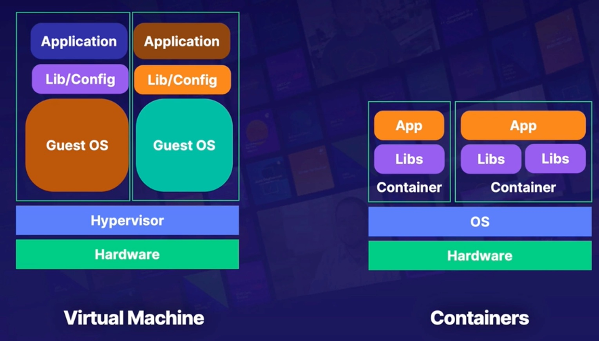

# Serverless Architecture

A short history of how things used to be and what we have now i.e. serverless:
- First there were physical data centres:
  - A long time ago, we put computers in a giant warehouse and called it a `data centre`.
- Next we had virtualisation:
  - We started to virtualise computers; computers running more computers inside of them.
- Then along came `the cloud`:
  - Running physical hardware is holding us back, so we now manage virtual compute.
- And finally `serverless`:
  - We focus on code and leave the management of the compute architecture behind.

## Computing with Lambda

AWS Lambda is a serverless compute service that lets you run code without provisioning or managing the underlying servers.
It's as if you are running code without computers.

- Runtime:
  - You'll need to pick from an available runtime or bring your own; this is the environment your code will run in.
- Permissions:
  - If your lambda function needs to make an AWS API call, you'll need to attach a role.
- Networking:
  - You can (optionally) define the VPC, subnet, and security groups your functions are a part of.
- Resources:
  - Defining the amount of available memory will allocate how much CPU and RAM your code gets.
- Trigger:
  - What's going to alert your lambda function to start? Defining a trigger will kick lambda off if that event occurs.

One of the most common ways you're going to see lambda used is to `add features to AWS`.

If you need to automatically remove entries from a security group, start and stop instances, or do anything else that isn't built in, `the answer is most likely going to be to use lambda to achieve that`.

## Leveraging the AWS Serverless Application Repository

- Serverless apps:
  - Allows users to easily find, deploy, or even publish their own serverless applications.
- Sharing:
  - Ability to privately share applications within orgs or publicly for the world.
- Manifest:
  - Upload your application code and a manifest file; known as the AWS SAM (Serverless Application Model) template.
- Integrations:
  - Deeply integrated with the AWS lambda service; appears within the console.

| Publish (vs)                                                       | Deploy                                            |
|--------------------------------------------------------------------|---------------------------------------------------|
| Publishing apps makes them available for others to find and deploy | Find and deploy published applications            |
| Define apps with AWS SAM templates                                 | Browse public apps without needing an AWS account |
| Set to private by default                                          | Browse within the AWS lambda console              |
| Must explicitly share if desired                                   |                                                   |

## Container overview

What is a Container?
- A container is a standard unit of software that `packages` up code and all its dependencies, so the application runs quickly and reliably from `one computing environment to another`.

- Dockerfile
  - Text document that contains all the commands or instructions that will be used to build an image.
- Image
  - Immutable file that contains the code, libraries, dependencies, and configuration files needed to run an application.
- Registry
  - Stores Docker images for distribution; can be both private and public.
- Container
  - A running copy of the image that has been created.

## Running Containers in ECS (Elastic Container Service) or EKS (Elastic Kubernetes Service)

Having a handful of containers is fine, but when we get into the 10s and 100s we need help to manage all our containers. Enter ECS:
- Management of containers at scale:
  - ECS can manage 1, 10, hundreds, thousands of containers; it will appropriately place the containers and keep them online.
- ELB integration:
  - Containers are appropriately registered with the load balancers as they come online and go offline.
- Role integration:
  - Containers can have individual roles attached to them, making security a breeze.

One downside of ECS, is that is propriety to AWS. To avoid this `tie-in` we can instead opt for Kubernetes.

Kubernetes is an open-source container management and orchestration platform:
- Open source alternative
- Can be used on-premises and in the cloud

Kubernetes itself can be pretty hard to configure/manage, and that is where EKS can help.
EKS is an AWS-managed version of Kubernetes.