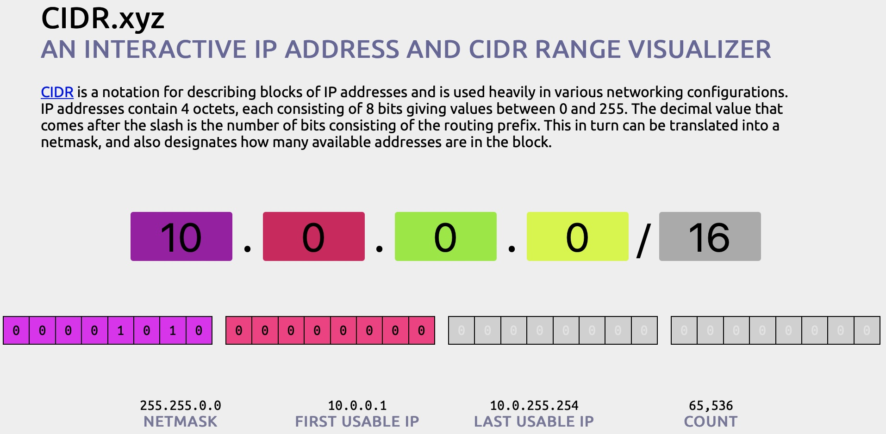
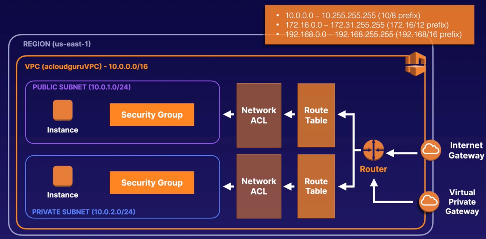
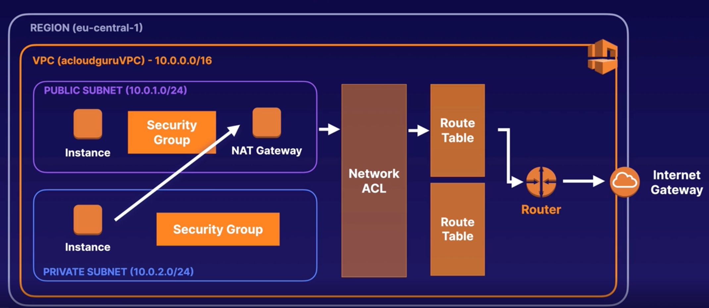

# Virtual Private Cloud (VPC) Networking

## Overview

Think of a [VPC](https://docs.aws.amazon.com/vpc/latest/userguide/configure-subnets.html) as a virtual data centre in the cloud.
- Logically isolated part of AWS Cloud where you can define your own network.
- Complete control of virtual network, including your own IP address range, subnets, route tables and network gateways.
- Fully customisable network:
  - You can leverage multiple layers of security, including security groups and network access control lists, to help control access to Amazon EC2 instances in each subnet.
- 1 subnet is always in 1 Availability Zone, where a subnet is essentially a `virtual firewall`.

E.g. a typical 3 tier system:
```
+--------------------+     +-----------------------+       +-------------------+
|     Web            |     |      Application      |       |      Database     |
|                    |     |                       |       |                   |
|Public facing subnet|     | Private subnet        |       | Private subnet    |
|                    |     | Can only speak to     |       | Can only speak to |
+--------------------+     | web and database tiers|       | application tier  |
                           +-----------------------+       +-------------------+
```

Additionally, you can create a `hardware virtual private network` connection between your corporate data centre and your VPC and leverage the AWS Cloud as an extension of your corporate data centre.

## CIDR

How to [calculate the IP address ranges](https://cidr.xyz) e.g.



As the number after the `slash` goes from say 2 to 28, the IP range count decreases as it marks how many bits to use after the say the first 2 there is 30 bits to use,
but after first 28, there is only 4 bits to use, which comes to a total count of 16 (IP addresses to use) i.e.

0 0 0 0
8 4 2 1 = 16

## Network diagram example

When setting up a VPC we have to choose our IP address range (refer to CIDR website):



So what can we do with a VPC?
- Launch instances
  - Launch instances into a subnet of our choosing
- Custom IP addresses
  - Assign custom IP address ranges in each subnet
- Route tables
  - Configure route tables between subnets
- Internet gateway
  - Create internet gateway and attach it to our VPC
- More control
  - Much better security control over our AWS resources
- Access control lists
  - Subnet network access control lists
  - And we can use network access control lists (NACLs) to block specific IP addresses

Default VPC vs custom VPC:
- Default
  - Default VPC is user friendly
  - All subnets in default VPC have a route out to the internet
  - Each EC2 instance has both a public and private IP address
- Custom
  - Fully customisable
  - Takes time to set up

We can build a VPC in the UI or with [terraform (an example)](../terraform/vpc/main.tf).

When creating a VPC, by default it creates:
- main route table
- main network ACL
- security group

## NAT Gateways for internet access (for EC2 instances in a private subnet)

The terraform example includes the following:
You can use a network address translation (NAT) gateway to enable instances in a private subnet to connect to the internet or other AWS services while preventing the internet from initiating a connection with those instances.

So how does the private subnet get access `out`? The solution is to provision a NAT gateway in our public subnet. We'll essentially end up with:


- NAT gateways are redundant inside the Availability Zone
- Starts at 5Gbps and scales currently to 45Gbps
- Not associated with security groups
- Automatically assigned a public IP address

## Protecting your resources with security groups

NOTE: If an inbound rule accepts a request, an outbound rule cannot prevent a response e.g.
```
EC2 instance <--------------- allow incoming on port 80 -----

----- response to the port 80 request cannot be blocked ----->
```

The above is due to the fact that security groups are `stateful` - Next we see that network ACLs are `stateless`.

## Controlling subnet traffic with network ACLs

- A network access control list (ACL) is an optional layer of security for your VPC that acts as a firewall for contolling traffic in and out of one or more subnets.
- You might set up network ACLs with rules similar to your security groups in order to add another layer of security to your VPC.

Overview:
- Default network ACLs:
  - Your VPC automatically comes with a default network ACL, and by default it allows all inbound and outbound traffic.
- Custom network ACLs:
  - You can create custom network ACLs.
  - By default each custom network ACL denies all inbound and outbound traffic until you add rules.
- Subnet associations:
  - Each subnet in your VPC must be associated with a network ACL.
  - If you don't explicitly associate a subnet with a network ACL, the subnet is automatically associated with the default network ACL.
- Block IP addresses:
  - Block IP addresses using network ACLs (not security groups).

- You can associate a network ACL with multiple subnets; however, a subnet can be associated with only 1 network ACL at a time.
  - When you associate a network ACL with a subnet, the previous associated is removed.
- Network ACLs contain a numbered list of rules that are evaluated in order, starting with the lowest numbered rule.
- Network ACLs have separate inbound and outbound rules, and each rule can either allow of deny traffic.
- Network ACLs are `stateless`; reponses to allowed inbound traffic are subject to the rules for outbound traffic (and vice versa).

Our [terraform example](../terraform/vpc/main.tf) shows the use of network ACL.